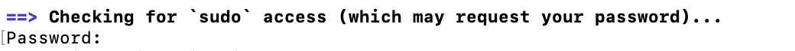
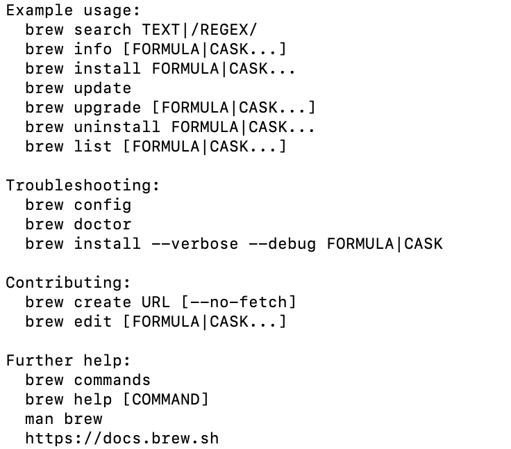

> [!IMPORTANT]
> Credits and Original Repo from [**/soraxas**](https://github.com/soraxas/echo360/blob/master/README.md)[^1]
> [^1]: Last used May2024 (still working)
 

### To download video From ECHO360 Step-By-Step (MAC OS):

Aims to help those who are beginner

*Open up a terminal window and install Git using the following command: `brew install git`
  * if the prompt says __command not found: brew__ then using the following command:
    * `echo 'eval "$(/opt/homebrew/bin/brew shellenv)"' >> ~/.zprofile` __ENTER__
    * `eval "$(/opt/homebrew/bin/brew shellenv)"` __ENTER__
  * if it prompts as image below 
  
    meaning that it requires your password (put your password) __ENTER__
    _To check if brew command available type:__ `brew` it should show as below:
    
 
 
* type : `git clone https://github.com/soraxas/echo360`
* 
